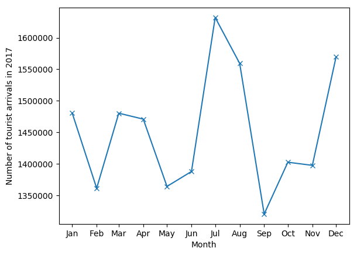
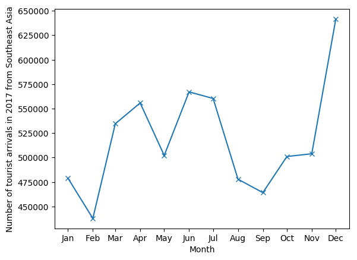
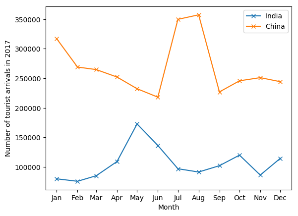

# Singapore Tourist Data 2017
By Rakshit Gogia

Version 1.1, 25th August 2018

This program uses pandas and matplotlib libraries to provide a visualisation for Singapore\'s tourist arrival data in 2017.
The data is publicly available at https://www.stb.gov.sg/statistics-and-market-insights/Pages/statistics-Visitor-Arrivals.aspx.

## Usage

python3 tourist.py \[-h] \[-q QUERY]

### optional arguments:
```
  -h, --help            show this help message and exit
  -q QUERY, --query QUERY
                        Name of specific country or region you want a
                        visualisation for. Multiple queries can be separated
                        by commas
```
### examples:
python3 tourist.py



python3 tourist.py -q "Southeast Asia"



python3 tourist.py -q "India, China"

